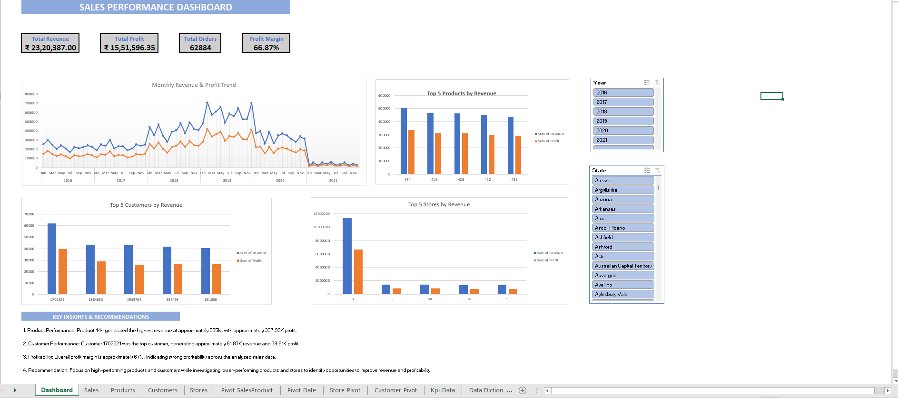

# Sales Performance Analysis — Excel

## Project Overview

An Excel-based sales performance analysis project developed to transform raw sales data into meaningful business insights using Excel formulas, PivotTables, and dashboard visualizations.

## Business Objective

The objective of this project is to analyze sales and profitability across products, customers, and stores, identify key revenue and profit drivers, and provide actionable insights to support business decision-making.

## Dataset

The project uses raw sales data containing information related to:

- Products
- Customers
- Stores
- Sales
- Profit
- Revenue
- Orders

The original raw files are included in the `Raw Files` folder.

## Tools Used

- Microsoft Excel
- Excel Formulas
- PivotTables
- PivotCharts
- Data Analysis
- Data Visualization

## Data Preparation

The raw sales data was organized and prepared for analysis by:

- Reviewing the available data fields
- Structuring the data for analysis
- Validating the data required for calculations
- Preparing the dataset for PivotTable analysis
- Creating the required calculations and metrics

## Analysis Performed

The analysis focused on:

- Product performance
- Customer performance
- Revenue analysis
- Profit analysis
- Profit margin analysis
- Store performance
- Identification of high-performing products and customers

## Dashboard Features

The Excel dashboard provides:

- Revenue analysis
- Profit analysis
- Profit margin analysis
- Product performance analysis
- Customer performance analysis
- Store performance analysis
- PivotTable-based analysis
- Dashboard visualizations

## Key Business Insights

- **Product Performance:** Product 444 generated the highest revenue at approximately **505K**, with approximately **337.99K profit**.

- **Customer Performance:** Customer 1702221 was the top customer, generating approximately **61.87K revenue** and **39.61K profit**.

- **Profitability:** The overall profit margin was approximately **67%**, indicating strong profitability across the analyzed sales data.

- **Recommendation:** Focus on high-performing products and customers while investigating lower-performing products and stores to identify opportunities to improve revenue and profitability.

## Dashboard Preview

## Files

- `Sales_Performance_Analysis.xlsx` — Main Excel workbook containing the analysis, PivotTables, and dashboard.
- `Sales_Performance_Dashboard.png` — Dashboard preview.
- `Raw Files/` — Original raw datasets used for the analysis.

## Skills Demonstrated

- Microsoft Excel
- Data Cleaning and Preparation
- Excel Formulas
- PivotTables
- PivotCharts
- KPI Analysis
- Profitability Analysis
- Product Analysis
- Customer Analysis
- Business Analysis
- Data Visualization
- Dashboard Development